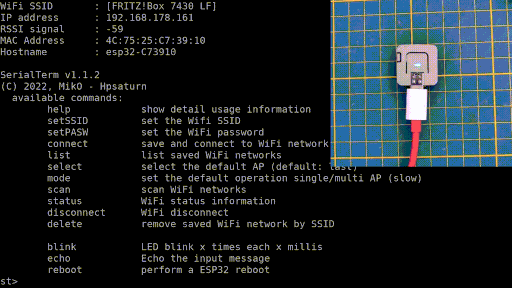

# esp32-wifi-cli

Basic and extendible Wifi CLI manager via serial command line for ESP32

## Demo


## Features

- [x] interactive serial terminal, prompt and backspace support
- [x] extendible: custom user commands and also the help menu
- [x] Wifi multi AP and single AP modes
- [x] preferences persist in flash ROM
- [x] two kind of parsers: Argument into quotes or two parameters
- [ ] debug messages mode off
- [ ] extend the CLI events callbacks
- [ ] esp8266 support

## Basic implementation

```cpp
#include <Arduino.h>
#include <ESP32WifiCLI.hpp>

void setup() {
  Serial.begin(115200);  // set here the Serial baudrate or in
  wcli.begin();          // the begin method like a parameter
  delay(100);
}

void loop() {
  wcli.loop();
}
```

Output

```bash
SerialTerm v1.1.2
(C) 2022, MikO - Hpsaturn
  available commands:
        help            show detail usage information
        setSSID         set the Wifi SSID
        setPASW         set the WiFi password
        connect         save and connect to WiFi network
        list            list saved WiFi networks
        select          select the default AP (default: last)
        mode            set the default operation single/multi AP (slow)
        scan            scan WiFi networks
        status          WiFi status information
        disconnect      WiFi disconnect
        delete          remove saved WiFi network by SSID

st>
```

## Custom parameters

You can extend the available commands adding new ones in the setup, like these:

```cpp
wcli.begin();
wcli.term->add("blink", &blink, "\tLED blink x times each x millis");
wcli.term->add("echo", &echo, "\tEcho the input message");
wcli.term->add("reboot", &reboot, "\tperform a ESP32 reboot");
```

For more details, please review the [M5Atom](examples/M5Atom/main.cpp) and [Advanced](examples/advanced/main.cpp) examples.




## PlatformIO install

You able to install this library with pio pkg command:

`pio pkg install --library "hpsaturn/ESP32 Wifi CLI@^0.1.0"`

Or add it in your ini file. Also you can compile here the examples with a simple `pio run` over root of this repo.

## Arduino IDE requirements

This ESP32 CLI is based on the old SerialTerminal of @miko007. Please first download and use my fork that has some improvements: [SerialTerminal Library](https://github.com/hpsaturn/SerialTerminal)

After that install ESP32 Wifi CLI library from this repo. Download it on [releases](https://github.com/hpsaturn/esp32-wifi-cli/releases).


## Credits

Extended from [SerialTerminal](https://github.com/miko007/SerialTerminal) by @miko007
